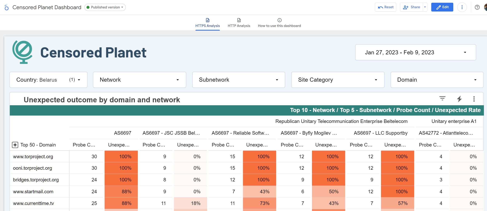
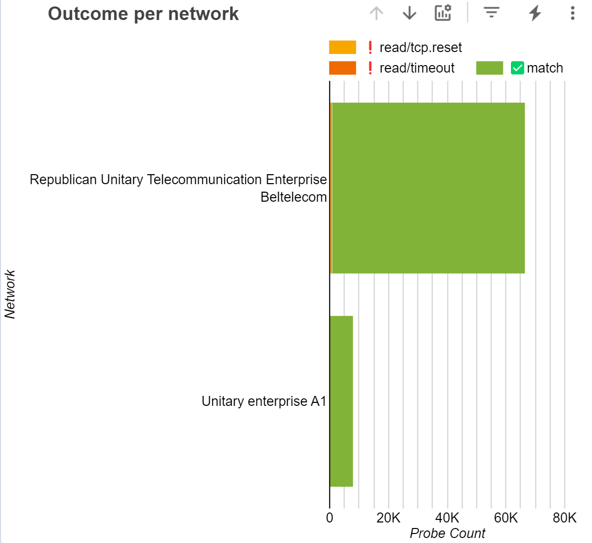

##############################
Censored Planet Data Analysis
##############################

The Censored Planet processed data files can be found on our `website <https://data.censoredplanet.org/raw>`_. The website provides raw data files separated by each country for every measurement scan provided by Censored Planet. If you need individual measurement data for a specific country, the best avenue to explore Censored Planet data is to download individual files from the website and explore them. 

For more large-scale data analysis, we have developed the `Censored Planet data analysis pipeline <https://github.com/censoredplanet/censoredplanet-analysis>`_ and accompanying public `Censored Planet Dashboard <https://dashboard.censoredplanet.org>`_. 

*****************************************
Censored Planet Data Analysis Pipeline
*****************************************
The `Censored Planet data analysis pipeline <https://github.com/censoredplanet/censoredplanet-analysis>`_, developed in collaboration with `Google Jigsaw <https://jigsaw.google.com/>`_.  takes `raw data from the Censored Planet Observatory <http://data.censoredplanet.org/raw>`_ and runs it through a data analysis pipeline to create database tables for easier data analysis.

Because of the size of the data involved (many TB) this project requires a devoted Google Cloud project to run in. It is not recommended for end users to run the full pipeline because of cost considerations, but the code is made available for anyone who wants to understand how the data pipeline works. Moreover, users can apply the pipeline on a small portion of the data which is of interest, which will be more cost-effective. Please refer to the development documentation at our `Github page <https://github.com/censoredplanet/censoredplanet-analysis>`_ and reach out to us at `censoredplanet-analysis@umich.edu` with any questions.

**************************
Censored Planet Dashboard
**************************
`The Censored Planet Dashboard <https://dashboard.censoredplanet.org>`_, built in collaboration with  with `Google Jigsaw <https://jigsaw.google.com/>`_ is an exploratory public data dashboard that uses data analyzed using the Censored Planet data analysis pipeline, and contains visualizations that allow easy exploration of Censored Planet measurements. 

=====
FAQ
=====

Q. How do I access the dashboard?

A. The dashboard is public to all users. If you are having any access issues, reach out to `censoredplanet-analysis@umich.edu`.

Q. What data is available on the dashboard?

A. Currently, the dasboard contains data from `Censored Planet's Hyperquack measurement technique <https://censoredplanet.org/projects/hyperquack>`_, which measures network interference on the HTTP, HTTPS, Echo and Discard protocols. The measurements on the Echo and Discard protocols also aim to detect HTTP censorship. The two tabs on the top of the dashboard (see figure below) can be used to view the data related to HTTPS and HTTP tests. The DNS data from `Satellite <https://censoredplanet.org/projects/satellite>`_ will be added to the dashboard soon. 

Q. What domains does Censored Planet test and how often are the tests run? 

A. Every week, Censored Planet runs two identical measurements to each domains from the `Citizen Lab Global Test List <https://github.com/citizenlab/test-lists>`_ and a selection of popular domains from the `Alexa Top Domains list <https://www.alexa.com/topsites/>`_ on each protocol. The dashboard also contains some data from special measurements to other domains (including those in the Citizen Lab regional lists). Only domains are tested during the longitudinal scans, but full URLs can be tested in special scans. 

Q. How are site categories calculated?

A. Site categories are derived from `Citizen Lab <https://github.com/citizenlab/test-lists>`_, and some websites are categorized manually. The site categorization may contain errors. Please submit a corrected category at `this form <https://forms.gle/78krbzEqr7vHYUrT6>`_ if you notice any errors in site categorization. 

Q. Can I filter by outcome?

A. Yes, please use the outcome filter on the 'How to use this dashboard' pane (shown below) to filter certain outcomes. A brief description of outcomes is also provided.

Q. What do the emojis on the outcome mean (for example, an '❗' before the 'read/tcp.reset')? 

A. We use emojis to better communicate our confidence of a particular outcome being indicative of a censorship event. For all "expected" outcomes where we do not observe any censorship, we use the '✅' emoji.  For unexpected outcomes that are more indicative of censorship, we use the '❗' emoji, while outcomes that may be both caused due to censorship as well as other reasons such as CDN localization or network errors are categorized using the '❓' emoji. Failed tests are marked in gray. 

=====================
Dashboard Walkthrough
=====================

We describe a demonstrative walkthough of how to use the Censored Planet dashboard to characterize censorship in a country.

1. Select country and time range

    * Open the dashboard and select the country of interest.
    * The dashboard will show the data for the last 14 days. Select a different time range if you would like to analyze a specific event. Keep in mind that longer ranges make the dashboard take longer to load.

2. Clean up the networks

    * Identify the networks of interest. This requires knowledge of the local context. You should remove all networks that do not correspond to local ISPs so they do not interfere with the row order.
        
        * The `Customers per AS table <https://stats.labs.apnic.net/cgi-bin/aspop?c=VN>`_ from APNIC may be useful if you are not familiar with the local ISPs.
        * Keep in mind that not all ISPs may be present because of a limitation in the collection methodology.
    * Alternatively, you may select one Network at a time using the filter, but it helps to get a view across Networks first to see if there's consistency. Consistent blocking across Networks is evidence of a national policy.
    * Remove CDNs and private companies such as banks from the list of IP organizations. Banks tend to have a lot more censorship than ISPs and may use different methods.

3. Identify how each ISP blocks sites (see `list of outcomes <https://github.com/censoredplanet/censoredplanet-analysis/blob/master/docs/merged_reduced_scans_table.md>`_)
   
    * In the outcomes per network chart, you can click on the "Optional metrics" icon and select "Unexpected count". That will show what types of unexpected outcomes you get for each network.
    * Keep in mind that not all mechanisms are measurable from outside the network, so the site may look unblocked when in fact it is.
    * Near 100% of the unexpected probe count should be for a single outcome. If you see more than one unexpected outcome for a network, you may need to dig deeper. You can click on the down arrow to see the unexpected outcomes per subneworks. If each subnetwork only has one unexpected outcome, you have characterized the censorship mechanisms for them.
    * If you still see different outcomes in a subnetwork, it may be the case that different domains are blocked by different mechanisms. Reset the "Optional Metrics" to "Probe Count" and click on some of the domains and see if you get consistent results. If you get consistent results, you can drill back up to networks to see if they stay consistent within the network. That will give you a simpler view.
    * If you still see inconsistent results, you should check the Outline Timeline. It may be the case that censorship for a domain changed during the selected time period.
    * If the results are still inconsistent, you may need further investigation beyond the dashboard, and look at the raw data.

4. Identify the blocked websites and categories
 
    * Click on the domains to confirm how and where they are blocked. For this it's better to restore the "Optional metrics" to "Probe Count". Take note of the site category they are in.
    * You can click on the "+" button over the domains column to see their categories.
    * As you identify blocked categories, you may exclude them from the Site Category filter to clean up the list. Pornogrpahy and gambling wesbites are often blocked and will monopolize the list.
    * You can look for a specific domain using the Domain filter

5. Analyze both HTTP and HTTPS blocking. DNS and IP-based blocking are not available yet but will be added soon

6. It's always helpful to try to confirm your observations with independent corroborating evidence from OONI, or by running your own probes (having access to the IPs and commands would help here). Make sure the other data sources report the same outcome you've identified in the Censored Planet data.