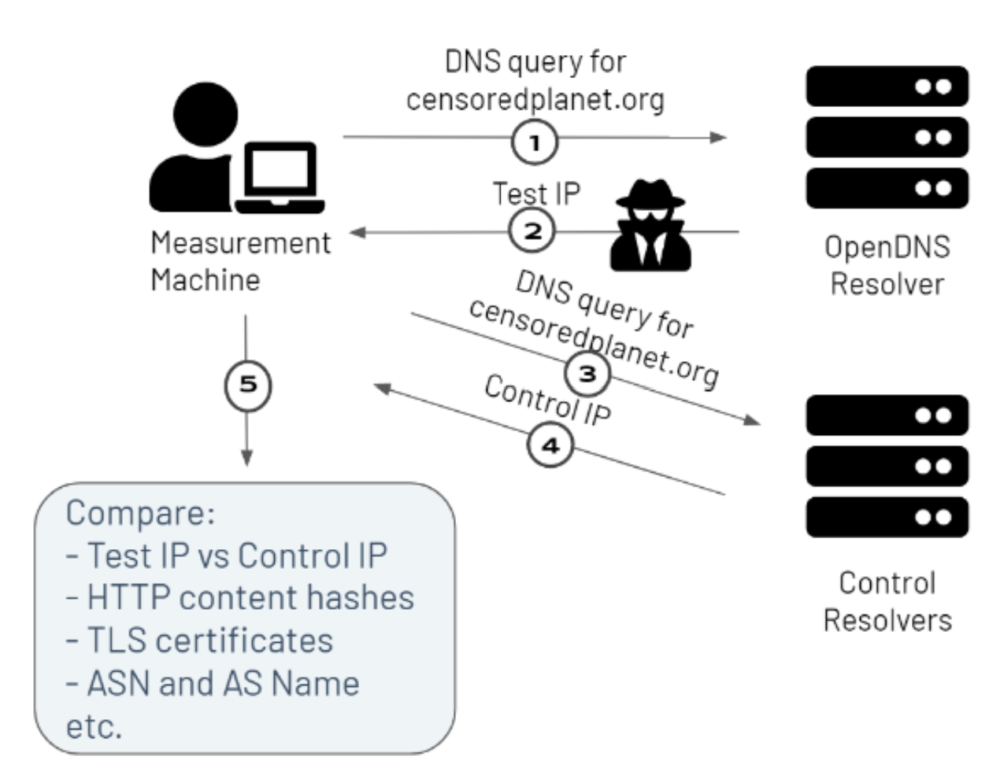
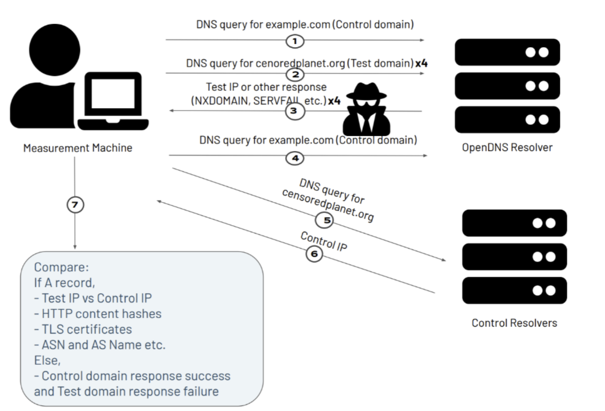

####################
DNS Data - Satellite
####################

`Satellite/Iris <https://censoredplanet.org/projects/satellite>`_ is Censored Planet’s remote measurement technique that detects DNS interference using Open DNS resolvers. Below, we provide an overview of Satellite and its data format. Refer to our `academic papers <https://censoredplanet.org/assets/Pearce2017b.pdf>`_ for in-depth details about Satellite.

************
Satellite-v1
************

Figure - Overview of Satellite-v1

Satellite-v1 is the first version of Satellite that we operated from August 2018 - February 2021. The primary function of Satellite is to detect incorrect DNS resolutions from open DNS resolvers in many countries.

* From a measurement machine at the University of Michigan, we send a DNS query for a website whose reachability we’re interested in, to an open DNS resolver in a country of interest (1). The response from the DNS resolver is our Test IP (2).

* We also send a DNS query for the same website to trusted control resolvers (3), and record their response as the control IP (4).

* We then compare the test and control responses using several heuristics, including a direct IP address comparison, and comparison of the AS number, AS names, HTTP content hashes, and TLS certificates associated with the test and control IP addresses (5). Satellite-v1 only labels a measurement as an anomaly when all of the heuristics mismatch.

Our various `publications <http://censoredplanet.org/publications>`_ and `reports <http://censoredplanet.org/reports>`_ have used Satellite-v1 to detect many cases of DNS manipulation. For instance, in our `recent investigation into the filtering of COVID-19 websites <https://censoredplanet.org/assets/covid.pdf>`_, Satellite-v1 found many networks using website filtering products to manipulate DNS responses of COVID-related websites.

Limitations
***********

Although Satellite-v1 was extremely useful in detecting DNS interference at large scale, it suffered from several limitations, which form the improvements in Satellite-v2.x.

* Satellite-v1 could not detect DNS censorship where A records were not available i.e. Satellite-v1 primarily focused on detecting incorrect DNS resolutions through the resolved IP address, and did not contain heuristics to measure DNS manipulation which manifested through timeouts, NXDOMAIN responses, SERVFAIL responses, etc.

* Satellite-v1 required post-processing to remove false positives and confirm the presence of anomalies, such as through using post-measurement heuristics and blockpage regexes. Satellite-v2 has the inbuilt capability to perform most post-processing measurements.

**************
Satellite-v2
**************

Figure - Overview of Satellite-v2

Satellite-v2 is our brand new version of Satellite, where we’ve made several modifications to the measurement technique and data format for facilitating accurate and efficient remote DNS interference measurements. Below, we detail the major changes we’ve made in Satellite-v2.

* **Fetching HTML pages hosted at resolved IPs marked as an anomaly** -  Satellite-v2 has an in-built fetch feature that performs HTTP and HTTPS GET requests to resolved IPs that fail our heuristics. This step was being performed as a post-processing step in Satellite-v1. This addition helps in quickly identifying blockpages such as the example shown in the figure below. Moreover, we are in the process of developing a technique to use TLS certificates to detect DNS manipulation. Reach out to `censoredplanet@umich.edu` for more information.

* **Measuring DNS interference without A records** - In Satellite-v2, we have added a sandwiched retry mechanism to our Satellite measurements in order to detect DNS interference that results in a non-zero R code response. A description of the method is shown in the figure below. We first make a control query to the open DNS resolver, providing a domain name that we do not expect to be blocked (eg. www.example.com). After the control query, we make up to 4 retries of the test DNS query, providing the test domain name. In case an A record is detected, we stop the test measurement. At the end, we perform another control query similar to the first measurement. The control queries ensure that the resolver is behaving correctly for an innocuous domain, and the multiple retry mechanism accounts for temporary errors in the network. With the help of the sandwiched retry mechanism, Satellite-v2 is able to detect DNS interference that manifests as timeouts, NXDOMAIN, SERVFAIL etc. From our preliminary analysis of Satellite-v2 data, we’ve already found several cases of DNS interference that can be identified using this method. For example, from the Satellite-v2 scan performed on 2021-03-17, we are able to identify 174,795 responses that have non-zero R codes from China, which makes up 15.6% out of the responses marked as interference. This kind of DNS interference was previously omitted by satellite v1. Shown below is an example measurement that passed the sandwich control tests, but received server failure R code. This could be an indicator of censorship or geoblocking.

* **Adding scan-level heuristics to exclude false positives** - Another step part of the post-processing pipeline of Satellite-v1 that is inbuilt in Satellite-v2. We exclude potentially false positive anomalies by using scan-level heuristics, such as the number of domains resolving to the anomalous IP address, or the anomalous IP address being part of a big CDN. Note that this step may lead to Satellite-v2 missing certain censorship.

* **Other changes** - We updated the heuristics to determine whether a DNS response is interfered - Satellite-v2 now includes a new “confidence” field, which addresses the certainty of interference according to the state of comparison between responses from the test resolvers and the control resolvers. We also make sure that IPs with no metadata information from Censys are not marked as interference.

**************
Satellite-v2.1
**************
Satellite-v2.1 incorporates minor changes from Satellite-v2.0, starting after April 14, 2021. Most of these changes are related to change in data formats. 

**************
Satellite-v2.2
**************
Satellite-v2.2 incorporates major changes in code and data structure from Satellite-v2.1, but no major changes in the functionality of Satellite. The changes are made after June 7, 2021 and they include,

* Store information generated from the query, tag, detect, and verify module in memory, producing only one file (results.json) as output, instead of generating outputs for every module. Renamed query-tag-detect-verify as “test” module, and probe-filter as “discovery”.

* Updated test module so that it first conducts queries for control resolvers, and then query, tag and detect test resolvers in batches.

*****
Notes
*****
While Satellite includes multiple control resolvers intended to avoid false inferences there is still a 
possibility that certain measurements are marked as anomalies incorrectly. To confirm censorship, it is
recommended that the raw DNS responses are compared to known blockpage fingerprints. The blockpage fingerprints
currently recorded by Censored Planet are available `here <https://assets.censoredplanet.org/blockpage_signatures.json>`_.
Moreover, aggregations can be used to avoid anomalous vantage points and domains.  
Please refer to our sample `analysis scripts <https://github.com/censoredplanet/censoredplanet>`_ for a guide on processing 
the data. 

Censored Planet detects network interference of websites using remote measurements to infrastructural vantage points 
within networks (eg. institutions). Note that this raw data cannot determine the entity responsible for the blocking 
or the intent behind it. Please exercise caution when using the data, and reach out to us at `censoredplanet@umich.edu` 
if you have any questions.