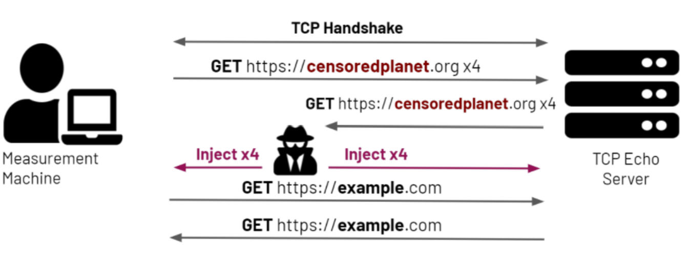

#########################
HTTP(S) Data - Hyperquack
#########################

Hyperquack (and Quack) is Censored Planet’s measurement techniques that measure application-layer interference using the Echo, Discard, HTTP, and HTTPS protocols. Below, we provide a detailed overview of Hyperquack, and the data formats of Hyperquack data `published on the Censored Planet website <http://data.censoredplanet.org/raw>`_. Refer to our academic papers for more information about `Quack <https://censoredplanet.org/assets/VanderSloot2018.pdf>`_ and `Hyperquack <https://censoredplanet.org/assets/filtermap.pdf>`_.

*************
Hyperquack-v1
*************

Figure - Overview of Hyperquack-

Quack-v1 and Hyperquack-v1 were operated from August 2018 to April 2021. Quack-v1 detects application-layer interference using the Echo and Discard protocols. Quack-v1’s workflow is pictured in Figure 1.

* From a remote measurement machine, we send an HTTP get look-alike request containing a non-sensitive control URL to a vantage point’s Echo or Discard port. Vantage points are selected from infrastructural servers such as ISP routers to minimize risk to their owners. We observe the result, and if the port is responding incorrectly according to its protocol, we abort the test, mark the vantage point as broken, and remove the vantage point from our test list.

* If the control test succeeds, we then send an HTTP get look-alike request containing a potentially sensitive URL to the vantage point. If the vantage point responds correctly, we record that there is not an anomaly. If the vantage point responds incorrectly, we repeat the request up to four more times. If any such request results in a correct response, we again record that there is not an anomaly.

* If all five requests result in incorrect responses, we then send another request containing a control keyword. If this request results in a correct response, we record the possibility of interference.

* If this control request results in an incorrect response, we wait some time then resend the request, to account for stateful interference. If the second request fails, we mark the vantage point as broken and remove the vantage point from our test list. If the request results in a correct response, we mark both potential interference and stateful interference.

Hyperquack-v1 is built up from the Quack-v1 protocol to include support for the HTTP and HTTPS protocols. Before performing any tests, we send multiple HTTP get requests containing non-sensitive control URLs to each of the vantage points we are testing. If the responses to all of the requests are consistent, the responses are stripped of dynamic content such as cookies and turned into a template for the vantage point. Then when performing the tests with the sensitive keywords, we compare the vantage point’s response to its template.

Our various `publications <https://censoredplanet.org/publications>`_ and `reports <https://censoredplanet.org/reports>`_ have used Quack-v1 and Hyperquack-v1 to detect many cases of application-layer interference. For instance, in our `recent investigation into the filtering of COVID-19 websites <https://censoredplanet.org/assets/covid.pdf`>_, Quack-v1 was used to detect censorship in unexpected places like Canada.

Data Format
***********

The published data has the following directory structure: ::

    CP_Quack-PROTOCOL-YYYY-MM-DD-HH-MM-SS/
    |-- servers.txt (List of vantage points used for measurements)
    |-- domains.txt (Test URLs)
    |-- results.json (Output file)
   

Outputs
=======

The relevant output is located in `results.json`

Fields
~~~~~~

* :code:`Server` : String
    The IP address of the vantage point used in this trial.
* :code:`Keyword` : String
    The URL being tested by this trial.
* :code:`Retries` : Integer
    The number of times Hyperquack had to resend the test packet in the course
    of the trial. For example, if the first packet sent to the vantage point
    returned the expected response, this field will be set to 0. If the first
    packet does not yield the expected response, every other packet sent by the
    system will increment this field by 1.
* :code:`Results`
    An array representing the results of each probe sent to the vantage point.
    Each entry is a JSON object with six subfields:
    
    * :code:`Sent` : String
        The contents of the packet sent to the vantage point. Note that this field 
        may not be populated in cases where there is no application-layer response 
        from the vantage point. In case the TCP handshake with the vantage point fails, 
        the error field will be set accordingly.  
    * :code:`Received` : JSON Object
        If the response given by the vantage point does not match the template,
        Hyperquack-v1 will add this field. Describes the response sent by the
        vantage point, including HTTP headers, the HTTP response code, the
        body of the response, and any TLS information. 

    * :code:`Success` : Boolean
        Each trial performed by Hyperquack determines whether or not the
        probe was interfered with by comparing the response returned by the
        vantage point to an already known template. If the response does not
        match, that is potentially evidence of interference. Set to :code:`true`
        if the response given by the vantage point matches the known template,
        and :code:`false` otherwise.
    * :code:`Error` : String
        If the probe fails with an error, that is potential evidence of
        blocking. If this occurs, this field will be populated. Describes the
        encountered error. Note that this field can be used to filter out TCP handshake and setup errors. 
    * :code:`StartTime` : Timestamp
        The time when the probe was sent.
    * :code:`EndTime` : Timestamp
        The time when the reponse to the probe response arrived.

* :code:`Blocked` : Boolean
    Indicates whether the probes to the vantage point show enough evidence to
    conclude that the vantage point has observed some sort of anomaly, potentially
    indicative of blocking.
* :code:`FailSanity` : Boolean
    Set to :code:`true` when all control probes sent to the vantage point fail to
    match the known template. This implies that the mismatching responses are
    due to an error in the vantage point or the network, not censorship. Rows with 
    :code:`FailSanity` set to :code:`true` should not be considered for analysis. 
* :code:`StatefulBlock` : Boolean
    Certain methods of censorship will block all communication from a given IP
    address for a length of time after that IP sends a request containing a
    censored keyword. We call this type of censorship ‘Stateful Blocking’. We
    detect this by sending a control probe immediately after our sensitive
    probes, waiting for some time (2 minutes), then sending another control probe. If the
    first control is blocked but the second isn’t, there is potentially
    stateful blocking. If this trial shows evidence of stateful blocking,
    this field is set to :code:`true`.

*************
Hyperquack-v2
*************

Hyperquack-v2 is our new version of both the Quack and Hyperquack measurement techniques. We’ve restructured the system to work as a request-based measurement server rather than a single-use measurement program. A user will run the program on a machine that will act as a server, and then users can interact with the program using a JSON API. The implications of this restructure are as follows.

* **Flexibility in Scheduling** - Unlike in Quack-v1 and Hyperquack-v1, when a scan is performed using Hyperquack-v2, a list of vantage points are added to Hyperquack-v2, then test keywords are added as work for the server to complete. When adding work, the user can specify which vantage points that work applies to, such as specifying all the vantage points in a given country, all the vantage points in a given subnet, or simply a list of specific vantage points. This allows users to more easily schedule targeted scans. To make differentiating between these concurrent scans easier, we also added a tagging system that allows for the output of Hyperquack-v1 to be redirected to custom files

* **On-the-fly Changes to Scans** - As a scan is running, the user can call endpoints to add work, add more vantage points, or remove vantage points. This further increases the flexibility of Hyperquack-v2, as scans can be updated in the middle of running as opposed to being re-run with updated parameters in Quack-v1 and Hyperquack-v1.

* **Stronger Vantage Point Evaluation** - In Quack-v1 and Hyperquack-v1, if a vantage point responded incorrectly to control probes, it would be completely removed from the scan. Since Hyperquack-v2 is continuously running, we have made it so a vantage point that fails one of the intermittent ‘health checks’ that Hyperquack-v2 performs has the potential to come back after a user-defined period of time. This will allow for greater coverage in cases where a vantage point experiences momentary failure.

* **Ability for More Complex Scheduling** - This paradigm allows for far more complex scheduling of work than the previous system. In future, our goal is to produce a system where users that want a scan performed can submit the scan parameters to a scheduler server, which will then send that work to any number of worker servers, each running an instance of Hyperquack-v2. This paradigm will allow for multiple workloads to be scheduled simultaneously alongside any rapid response scans that crop up.

Below is a list of the other major changes we've made to Hyperquack-v2.

* **Combining Quack and Hyperquack** - Hyperquack-v2 combines the Quack and Hyperquack measurement methods by creating a standard interface for how internet protocols can be used for internet censorship measurement. With this interface, new protocols can be easily added to Hyperquack-v2.

* ** Changes to Output Format ** - In addition to the output from censorship trial, Hyperquack-v2 outputs the results of the previously mentioned ‘health checks’ from vantage points. This output is very similar to the trial output, with the change that if the ‘health check’ is passed, a template will be included. All responses from the vantage point will be compared to the template to detect interference. At the moment, the templates for the Echo and Discard protocols are pre-defined by the protocol, so only the HTTP and HTTPS protocols will have these dynamically-computed templates included.

Data Format
***********

Trial Outputs
=============

Trial outputs are produced when Hyperquack-v2 attempts to measure whether or not
a vantage point observes the blocking of a given keyword by sending one or more
probes to a vantage point.

Fields
~~~~~~

* :code:`vp` : String
    The IP address of the vantage point used in this trial.
* :code:`location`
    The location of the vantage point. This field has two
    subfields:
    
    * :code:`country_name` : String
        The name of the country the vantage point resides in, as provided by
        the MaxMind geolocation database.
    * :code:`country_code` : String
        The two letter code associated with the aforementioned country.

* :code:`service` : String
    The service of the vantage point we are using for this trial.
    This field is set to the name of the service. 
    If the service is running on a non-standard port,
    a colon and the port number are appended
    (i.e., *discard* for discard on port 9, or *echo:8080* for echo on port 8080).
* :code:`test_url` : String
    The URL being tested by this trial.
* :code:`response`
    An array representing the results of each probe sent to the vantage point.
    Each entry is a JSON object with six subfields:

    * :code:`matches_template` : Boolean
        Each trial performed by Hyperquack-v2 determines whether or not the
        probe was interfered with by comparing the response returned by the
        vantage point to an already known template. If the response does not
        match, that is potentially evidence of blocking. Set to :code:`true`
        if the response given by the vantage point matches the known template,
        and :code:`false` otherwise.
    * :code:`response` : JSON Object
        If the response given by the vantage point does not match the template,
        Hyperquack-v2 will add this field. Describes the response sent by the
        vantage point, including HTTP headers, the HTTP response code, the
        body of the response, and any TLS information. 
    * :code:`error` : String
        If the probe fails with an error, that is potential evidence of
        blocking. If this occurs, this field will be included. Describes the
        encountered error. Note that this field can be used to filter out TCP handshake and setup errors. 
    * :code:`control_url` : String
        During a trial, Hyperquack-v2 will sometimes send probes with
        non-sensitive URLs if all probes with sensitive URLs show
        evidence of being censored. If the probe described by this entry in the
        results array is a control probe, this field will be included. Contains
        the control URL used in the probe.
    * :code:`start_time` : Timestamp
        The time when the probe was sent.
    * :code:`end_time` : Timestamp
        The time when the reponse to the probe response arrived.

* :code:`anomaly` : Boolean
    Indicates whether the probes to the vantage point show enough evidence to
    conclude that the vantage point has observed some sort of anomaly, potentially
    indicative of blocking.
* :code:`controls_failed` : Boolean
    Set to :code:`true` when all control probes sent to the vantage point fail to
    match the known template. This implies that the mismatching responses are
    due to an error in the vantage point or the network, not censorship. Rows with 
    :code:`controls_failed` set to :code:`true` should not be considered for analysis.
* :code:`stateful_block` : Boolean
    Certain methods of censorship will block all communication from a given IP
    address for a length of time after that IP sends a request containing a
    censored keyword. We call this type of censorship ‘Stateful Blocking’. We
    detect this by sending a control probe immediately after our sensitive
    probes, waiting for some time, then sending another control probe. If the
    first control is blocked but the second isn’t, there is potentially
    stateful blocking. If this trial shows evidence of stateful blocking,
    this field is set to :code:`true`.
* :code:`tag` : String
    If the work that produced this output was added to Hyperquack-v2 with a tag,
    this field will be included. Contains the work's tag.

Evaluation Outputs
==================

Evaluation outputs are produced when the Hyperquack-v2 performs a health
evaluation of a vantage point's service. Services are evaluated by sending one
or more probes containing control keyoword to the vantage point.

Fields
~~~~~~

* :code:`vp` : String
    The IP address of the vantage point being evaluated..
* :code:`service` : String
    The service of the vantage point that is being evaluated. This field is set
    to the name of the service. If the service is running on a non-standard
    port, a colon and the port number are appended
    (i.e., *discard* for discard on port 9, or *echo:8080* for echo on port 8080).
* :code:`response`
    An array representing the results of each probe sent to the vantage point.
    Each entry is a JSON object with five subfields:

    * :code:`test_url` : String
        The control URL used for this probe.
    * :code:`response` : JSON Object
        If the vantage point responds to the probe, this field is added.
        Describes the response sent by the vantage point, including the HTTP
        headers, the HTTP response code, and the body of the response.
    * :code:`error` : String
        If the probe fails with an error this field is included. Describes the
        encountered error.
    * :code:`start_time` : Timestamp
        The time when the probe was sent.
    * :code:`end_time` : Timestamp
        The time when the reponse to the probe finished arriving.

* :code:`template` : JSON Object
    If Hyperquack-v2 is able to generate a template from the probes, this field
    is included.
    Represents the expected response from the vantage point when sent a probe
    containing an uncensored keyword. If the service being tested is HTTP or 
    HTTPS, this field is an HTTP response, including HTTP headers, the HTTP
    response code, and the body of the response. If the service is Echo or
    Discard, this field is omitted. This template is gereated by the first
    probe during the health evaluation.
* :code:`issue` : String
    If there was an issue in generating the template for this service, this
    field will be included. Describes the issue encountered when generating the
    template or when comparing subsequent control probes to the template.
* :code:`tag` : String
    If the work that produced this output was added to Hyperquack-v2 with a tag,
    this field will be included. Contains the work's tag.

*************
Hyperquack-v2-raw
*************

To provide raw data for easy data analysis, we made the following changes:

1. Split data based on the country of vantage points so that it is easier to select and download data according to users' country of interest.

2. Separated the data collection phase and data analysis phase. Right now the Hyperquack data from our `raw measurement data website <https://data.censoredplanet.org/raw>`_ is truthful to the data collected without further analysis. We deprecated the “anomaly” field since there are misunderstandings that anomaly represents censorship.

3. Added new data containing further metadata fields and flattened nested data for easy analysis. Modified field names for disambiguation purposes.

    * :code:`domain` : String
        The test domain being queried.
    * :code:`domain_is_control` : Boolean
        Equals true if the queried domain is for the liveness test.
    * :code:`date` : String
            The date of the measurement.
    * :code:`start_time` : String
            The start time of the measurement.
    * :code:`end_time` : String
            The end time of the measurement.
    * :code:`server_ip` : String
        The IP address of the vantage point.
    * :code:`server_netblock` : String
        The netblock the vantage point belongs to.
    * :code:`server_asn` : String
        The AS number of the AS the vantage point resides in.
    * :code:`server__as_name` : String
        The name of the AS the vantage point resides in.
    * :code:`server__as_full_name` : String
        The full name of the AS the vantage point resides in.
    * :code:`server__as_class` : String
        The class of the AS the vantage point resides in.
    * :code:`server_country` : String
        The country the vantage point resides in.
    * :code:`server_organization` : String
        The IP organization the vantage point resides in.
    * :code:`source` : String
        Tar file name of the measurement.
    * :code:`received_error` : String
        Flatten error messages from the received responses.
    * :code:`received_status`: String
        Flatten status code from the received responses.
    * :code:`received_headers`: String
        Parsed HTTPS page headers.
    * :code:`received_body`: String
        Parsed HTTPS page body.
    * :code:`received_tls_version`: String
        Parsed TLS version.
    * :code:`received_tls_cipher_suite`: String
        Parsed TLS cipher suite.
    * :code:`received_tls_cert`: String
        Parsed TLS certificate.
    * :code:`received_tls_cert_common_name`: String
        Parsed common name field from TLS certificate.
    * :code:`received_tls_cert_alternative_names`: String
        Parsed alternative name field from TLS certificate.
    * :code:`received_tls_cert_issuer`: String
        Parsed issuer field from TLS certificate.
    * :code:`matches_template`: Boolean
        Equals true if the response given by the vantage point matches the known template.
    * :code:`no_response_in_measurement_matches_template`: Boolean
        Equals true if the responses from all the trials failed to match the known template.
    * :code:`controls_failed`: Boolean
        Set to :code:`true` when all control probes sent to the vantage point fail to match the known template. This implies that the mismatching responses are due to an error in the vantage point or the network, not censorship. Rows with :code:`controls_failed` set to :code:`true` should not be considered for analysis. 
    * :code:`stateful_block` : Boolean
        Equals true if another control probe sent immediately after our sensitive probes is blocked, but the second control measurement sent after 2 minutes was not.
    

*************
Notes
*************
While Hyperquack-v2 includes multiple trials intended to avoid random network errors, there is still a 
possibility that certain measurements are marked as anomalies incorrectly. To confirm censorship, it is
critical that the raw responses are compared to known blockpage fingerprints. The blockpage fingerprints
currently recorded by Censored Planet are available `here <https://assets.censoredplanet.org/blockpage_signatures.json>`_.
Moreover, network errors (such as TCP handshake and Setup errors) must be filtered out to avoid false inferences. 
Please use our `analysis pipeline <https://github.com/censoredplanet/censoredplanet-analysis>`_ 
to process the data before using it.

Censored Planet detects network interference of websites using remote measurements to infrastructural vantage points 
within networks (eg. institutions). Note that this raw data cannot determine the entity responsible for the blocking 
or the intent behind it. Please exercise caution when using the data, and reach out to us at `censoredplanet@umich.edu` 
if you have any questions.