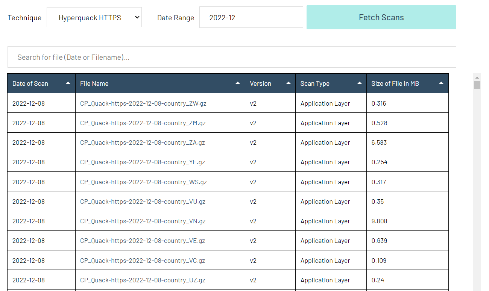

.. Censored Planet Observatory documentation master file, created by
   sphinx-quickstart on Thu Oct 15 13:46:23 2020.
   You can adapt this file completely to your liking, but it should at least
   contain the root `toctree` directive.

#######################################################
Welcome to Censored Planet Observatory's documentation!
#######################################################

`Censored Planet <https://censoredplanet.org>`_ is a longitudinal censorship measurement platform that collects remote measurement measurements in more than 200 countries. Censored Planet was launched in August 2018, and has since then collected more than 45 billion measurement data points. Censored Planet measures network interference on the TCP/IP, DNS, and HTTP(S) protocols, using remote measurement techniques `Augur <https://censoredplanet.org/projects/augur>`_, `Satellite <https://censoredplanet.org/projects/satellite>`_, and `Hyperquack <https://censoredplanet.org/projects/hyperquack>`_ respectively.  Every week, Censored Planet collects reachability data about 2000 popular and sensitive websites from more than 95,000 vantage points around the world. An academic paper about Censored Planet can be found `here <https://censoredplanet.org/assets/censoredplanet.pdf>`_.

Censored Planet’s measurement data has been crucial in identifying and monitoring several important censorship and network interference events. In 2019, Censored Planet data was used to `study the large-scale HTTPS interception that occurred in Kazakhstan <https://censoredplanet.org/kazakhstan>`_, and was instrumental in driving changes in major web browsers that blocked the interception attack. Censored Planet data has been used to `study Russia’s decentralized censorship mechanism <https://censoredplanet.org/russia>`_, and `the throttling attack they performed on Twitter <https://censoredplanet.org/throttling>`_.  Censored Planet has also been used to `identify the deployment of network censorship devices <https://censoredplanet.org/filtermap>`_, and `track the blocking of COVID-19 related websites around the world <https://censoredplanet.org/covid>`_. 

Censored Planet data is available to the public through the Censored Planet website: `data.censoredplanet.org/raw <https://data.censoredplanet.org/raw>`_. The Censored Planet raw data website contains archived compressed data files corresponding to one scan using each measurement technique. 

Figure - Raw data files on the Censored Planet website

Each scan contains a test of all 2,000 websites tested by Censored Planet with a set of vantage points across different countries. The archive files can be downloaded, extracted and analyzed. The data formats change based on the version of the measurement technique. The data formats and tips for analyzing the data for each of the published data files and versions are available below. It is critical that the raw data produced by Censored Planet is treated as a network observation and analyzed further using our `analysis pipeline <https://github.com/censoredplanet/censoredplanet-analysis>_` sample `analysis scripts <https://github.com/censoredplanet/censoredplanet>`_ 
 before use. For more information about using the data, please refer to the `Censored Planet Github <https://github.com/censoredplanet/censoredplanet>`_, or email Censored Planet at `censoredplanet@umich.edu <mailto:censoredplanet@umich.edu>`_. 

********
Contents
********

.. toctree::
    :maxdepth: 4
   
    version
    dns
    http
    analysis

******************
Indices and tables
******************

* :ref:`genindex`
* :ref:`modindex`
* :ref:`search`
